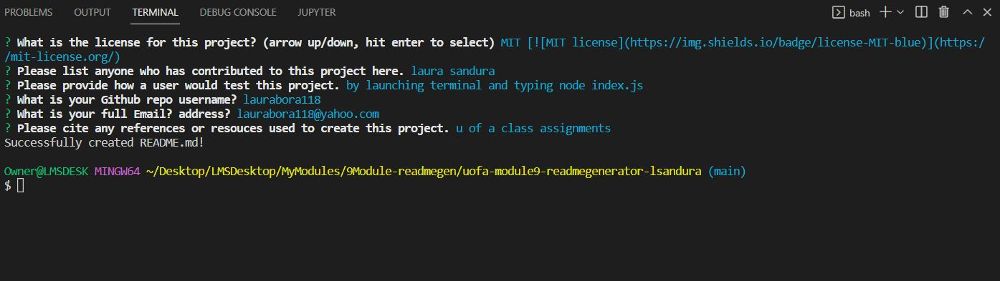
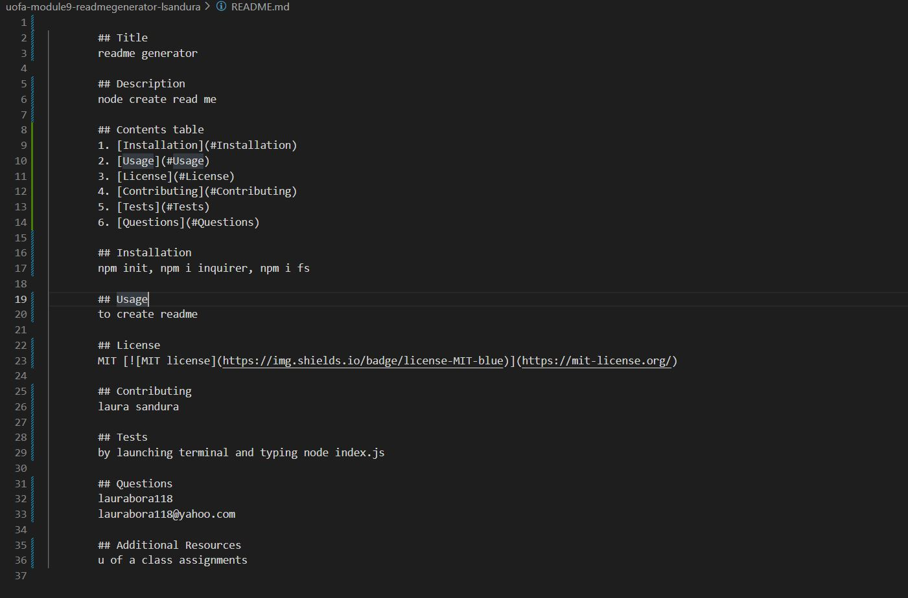

# uofa-module9-readmegenerator-lsandura
node.js professional read.me generator completed by Laura Sandura

#Main Objective: 
To create a read me that is professional for a new project.

#Challenge:
Using command-line that accepts input from the user when prompted to great a professional README.md with several areas including title, description, contents table, installation, usage, license, contributing, tests, and questions.
the user input to the questions for each area is added in to the appropriate README sections. License options gives a list and a badge for the license is displayed at the top of the README. For the questions user name and email they both fall into the questions section. The links in the contents table allow users to be taken to appropriate sections clicked.

#Additional Expectations:
    Make a video of the assignment showing it works
    Have a .gitignore file that includes node_modules/ and .DS_Store/ so theses are not tracked or uploaded to GitHub. 

#Assignment Example 
Pictures:
    
    

#Links:
Repository link where finalzed project can be pulled:
    https://github.com/laurabora118/UofA-Module6-ServerAPIWeather-LSandura

#Git Repository Site that shows finalized projectresults:
    https://laurabora118.github.io/UofA-Module6-ServerAPIWeather-LSandura/

#Video link:
    Link to watch online:
    https://watch.screencastify.com/v/z66xtasmkzGgHubj4Asz
    
    Raw mp4 video to watch must download
    (./assets//uofa-module9-readmegenerator-lsandura-video.mp4)

#How to open assignment after repo clone:
    Make sure to install node and inquirer to run these files.
    
#References:
    1 - Assignment criteria received in UofA assignment and knowlege from past assignments
    2 - Used Screencastify to create video
